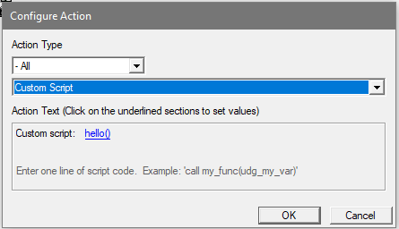
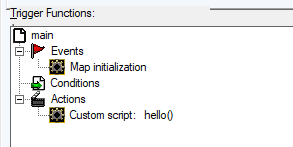

# Where my code start?
Let's say you want to jump into programing. How do you make your first "Hello world"?  

The first thing you should know is that WC3 will try to run the start function from **every** trigger.  
The second thing is that the name of the start function depends on the name of your trigger.  
* If your trigger is called **Hello**, the start function is **InitTrig_Hello**.  
* If your trigger is called **Hello world**, the start function is **InitTrig_Hello_world**.  

Now create one custom script and name it **Hello world**, insert the following code:  
```jass
function InitTrig_Hello_world takes nothing returns nothing
  call DisplayTextToForce( GetPlayersAll(), "Hello world")
endfunction
```

If you try the same in lua you will notice that doesn't work.  
You will have to make a trigger call your code.  

  

  

```lua
function hello()
  DisplayTextToForce(GetPlayersAll(), "classic hello world")

  print("new hello world")
end
```